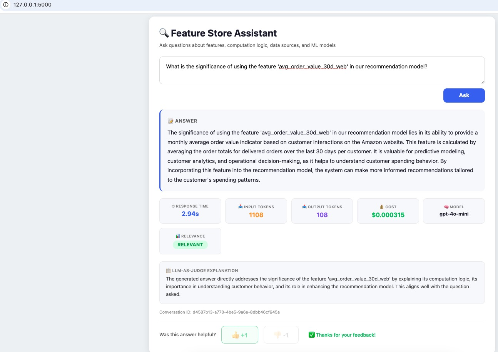
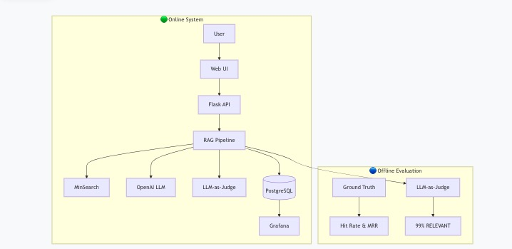
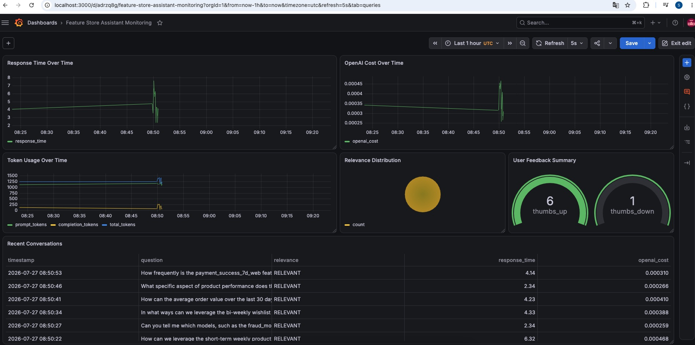

# Feature Store Assistant

Modern ML platforms drown data scientists in hundreds of feature definitions, making it nearly impossible to find the right features, understand computation logic, or track model lineage and data sources.

Feature Store Assistant turns scattered feature metadata into a conversational knowledge base with a chat interface, enabling natural-language discovery of 70+ ML features through hybrid search (keyword + semantic vector), Reciprocal Rank Fusion, query rewriting, and reranking—achieving 89% MRR and 98% Hit Rate on offline evaluation.

The system includes offline/online evaluation pipelines (LLM-as-Judge at 99% relevant, user feedback), LLMOps monitoring with OpenTelemetry, PostgreSQL, Grafana, and Docker, plus optimized context selection to minimize inference costs while maintaining retrieval quality.

**Tech Stack:**
- **RAG Pipeline**: MinSearch with optimized TF-IDF field boosting (89.8% MRR), query rewriting and reranking for improved retrieval performance
- **LLM**: OpenAI GPT-4o-mini for dataset generation, ground truth question creation, answer generation, and LLM-as-Judge relevance evaluation
- **Offline and online Evaluation**: Offline evaluation using Hit Rate & MRR on ground truth data, plus online LLM-as-Judge for automated relevance scoring (99% RELEVANT)
- **Web Interface**: Flask with modern responsive UI
- **Database**: PostgreSQL for conversation and feedback storage
- **Monitoring**: Grafana dashboards for response time, token usage, cost, and quality metrics
- **Containerization**: Docker Compose for seamless deployment

Built as the capstone project for [LLM Zoomcamp](https://github.com/DataTalksClub/llm-zoomcamp).

## Demo Video (Click the image to watch the demo video)

<p align="center">
  <a href="https://youtu.be/xb20JY70jtA" target="_blank">
    
  </a>
</p>

<p align="center">
  <b> Click the image above to watch the demo video</b>
</p>


## Problem Statement
Modern ML platforms often contain hundreds of features with complex computation logic, making it difficult for data scientists to:

- Find the right features for their models
- Understand how features are computed
- Know which models use specific features
- Track feature update frequencies and data sources

The **Feature Store Assistant** is a Retrieval-Augmented Generation (RAG) application that addresses these challenges by providing:

- Feature Discovery – Search features by name, description, or business context.
- Computation Understanding – Explain how features are calculated.
- Model Lineage – Identify which models consume specific features.
- Data Source Tracking – Show where features originate.
- Update Frequency – Display how often features are refreshed.
- Conversational Interaction – Answer questions using natural language instead of manual documentation searches.

# Prerequisites

- Python 3.12+
- Docker & Docker Compose
- OpenAI API Key
- direnv
- uv

## Access the Application

| Service | URL |
|---------|-----|
| **Flask Web UI** | http://localhost:5000 |
| **Grafana Dashboard** | http://localhost:3000 (admin/admin) |


## Full Setup

### 1. Install `direnv`

```bash
sudo apt install direnv
direnv hook bash >> ~/.bashrc
```

### 2. Configure the Environment

Copy the environment template and add your OpenAI API key.

```bash
cp .envrc_template .envrc
direnv allow
```


### 3. Install Dependencies

```bash
uv sync
```

### 4. (Optional) Install MinSearch

If `minsearch` is not installed, install it manually.

```bash
uv add git+https://github.com/alexeygrigorev/minsearch.git
```

### 5. Start the Services

Start the application dependencies using Docker Compose.

```bash
docker-compose up -d
```

### 6. Initialize the Database

```bash
cd feature_store_assistance
export POSTGRES_HOST=localhost
uv run python db_prep.py
```

### 7. Run the Web Application

```bash
cd feature_store_assistance
export POSTGRES_HOST=localhost
uv run python app_web.py
```

The application will be available at:

- **Web UI:** http://localhost:5000

### 8. Set Up Grafana

#### 8.1 Add the PostgreSQL Data Source

1. Open **http://localhost:3000**
2. Log in using:
   - **Username:** `admin`
   - **Password:** `admin`
3. Navigate to **Configuration → Data Sources → Add data source**
4. Select **PostgreSQL**
5. Configure the connection using the following settings:

| Setting | Value |
|---------|-------|
| **Name** | PostgreSQL |
| **Host** | `postgres:5432` *(or use the PostgreSQL container IP address)* |
| **Database** | `feature_store` |
| **User** | `user` |
| **Password** | `password` |
| **SSL Mode** | `disable` |

#### 8.2 Import the Grafana Dashboard

```bash
cd grafana
uv run python init.py
```

After importing, open **http://localhost:3000** to view the dashboard, which includes:

- Response Time
- OpenAI API Cost
- Token Usage
- LLM Relevance Score
- User Feedback
- Recent Conversations

# Testing

## Run the test script

```bash
cd feature_store_assistance

uv run python test.py
```

# API Testing

## Ask a Question

```bash
URL=http://localhost:5000

QUESTION="what features are used for personalized promotion campaigns?"

curl -X POST \
  -H "Content-Type: application/json" \
  -d '{"question": "'"${QUESTION}"'"}' \
  ${URL}/question
```

## Submit Feedback

```bash
ID="65f65c7e-6383-4753-b29f-530ad418e594"

curl -X POST \
  -H "Content-Type: application/json" \
  -d '{"conversation_id":"'"${ID}"'","feedback":1}' \
  ${URL}/feedback
```

Example response:

```json
{
  "message": "Feedback received for conversation 65f65c7e-6383-4753-b29f-530ad418e594: 1"
}
```

# Database Testing

## Recent Conversations

```bash
docker exec -it feature-store-assistant-postgres-1 \
psql -U user -d feature_store \
-c "SELECT id, question, answer, model_used, response_time, relevance, timestamp
FROM conversations
ORDER BY timestamp DESC
LIMIT 10;"
```

## Recent Feedback

```bash
docker exec -it feature-store-assistant-postgres-1 \
psql -U user -d feature_store \
-c "SELECT * FROM feedback
ORDER BY timestamp DESC
LIMIT 10;"
```


# Evaluation

## Retrieval Evaluation

Ground truth dataset contains **200 generated feature questions**.

| Approach | Hit Rate | MRR |
|----------|---------:|----:|
| Baseline (No Boosting) | 98.9% | 86.1% |
| Optimized (Boosting) | **98.9%** | **89.8%** |

**Improvement:** +3.7% MRR

### Best Boosting Parameters

```python
boost = {
    "feature_name": 2.07,
    "feature_group": 0.18,
    "feature_description": 2.70,
    "computation_logic": 1.91,
    "models_using_feature": 1.17,
    "data_source": 1.30,
    "serving_store": 0.77,
    "update_frequency": 0.58,
}
```


## RAG Flow Evaluation

LLM-as-a-Judge over 200 sampled questions. Results for gpt-4o-mini:

- 98% RELEVANT
- 2% PARTLY_RELEVANT
- 0 NON_RELEVANT

Also tested gpt-4o:

- 99% RELEVANT
- 1% PARTLY_RELEVANT
- 0 NON_RELEVANT

The RAG system consistently produces relevant answers due to high retrieval quality (MRR 89.8%) and well-structured feature metadata.

### Evaluation Notebooks

- `notebooks/rag-test.ipynb`
- `notebooks/evaluation-data-generation.ipynb`

Evaluation data:

```
data/rag-eval-gpt-4o-mini.csv
```


## Architecture
<p align="center">
  
</p>

# Flask UI

<p align="center">
  
</p>

The web interface (`app_web.py`) includes:
- Large search box
- Conversational Q&A
- Response metrics
- LLM relevance score
- Judge explanation
- User feedback buttons
- Conversation history

# Monitoring

6 Grafana Dashboards:
<p align="center">
  
</p>

**URL:** http://localhost:3000

Default Login:

- Username: `admin`
- Password: `admin`

The dashboard tracks:

- Response Time Over Time: Tracks LLM latency trends to monitor performance degradation over time
- OpenAI Cost: Monitors API spending over time to help manage budget and detect cost anomalies
- Token Usage: Shows prompt, completion, and total token usage patterns to optimize prompt efficiency
- Relevance Distribution: Displays answer quality breakdown from LLM-as-Judge (RELEVANT / PARTLY_RELEVANT / NON_RELEVANT)
- User Feedback Summary: Shows thumbs up/down ratio from user feedback, providing a direct measure of user satisfaction
- Recent Conversations: Lists the most recent user interactions with metadata for quick debugging and monitoring

Grafana configuration files:

```
grafana/
├── init.py
└── dashboard.json
```

# Project Structure

```text
feature_store_assistance/
├── app.py
├── app_web.py
├── rag.py
├── ingest.py
├── db.py
├── db_prep.py
├── test.py
│
├── data/
│   ├── feature_store_data.csv
│   ├── ground-truth-retrieval.csv
│   └── rag-eval-gpt-4o-mini.csv
│
├── notebooks/
│   ├── rag-test.ipynb
│   └── evaluation-data-generation.ipynb
│
├── grafana/
│   ├── init.py
│   └── dashboard.json
│
├── docker-compose.yaml
├── Dockerfile
├── pyproject.toml
└── README.md
```


# Dataset

The dataset contains **72+ synthetic e-commerce features** generated with OpenAI.

Each feature includes:

| Field | Description |
|------|-------------|
| id | Unique feature identifier |
| feature_name | Feature name |
| feature_group | Feature category |
| computation_logic | SQL or pseudocode |
| data_source | Source table or layer |
| update_frequency | Refresh frequency |
| serving_store | Feature serving system |
| models_using_feature | ML models consuming the feature |
| feature_description | Business-friendly explanation |

## Feature Groups

- Customer Behavior
- Customer Spend
- Product Engagement
- Product Quality
- Search Behavior
- Inventory
- Logistics
- Marketing
- Payment


# Design Decisions & Trade-offs

### MinSearch vs Vector Database

The dataset is relatively small (72+ features), so TF-IDF with tuned boosting provides excellent retrieval quality without requiring a vector database.

**Trade-off:** Semantic matching is weaker for heavily paraphrased queries.


### GPT-4o-mini vs GPT-4o

Evaluation showed nearly identical answer quality while GPT-4o-mini significantly reduced inference cost.


### In-Memory Search Index

The search index is built during application startup.

**Advantages**

- Simple deployment
- No additional infrastructure

**Trade-off**

- Index rebuild required after every restart.


### Flask vs FastAPI

Flask was chosen for its simplicity.

**Trade-off**

- No built-in asynchronous support.


### LLM-as-a-Judge

Automated evaluation provides scalable relevance scoring.


## Made with ❤️ for LLM Zoomcamp

